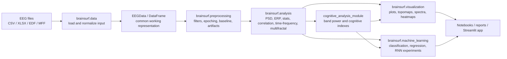

# BrainSurf

BrainSurf is an open-source Python library for EEG signal processing and analysis, with a focus on meditation and cognitive-state research. It provides utilities for loading EEG datasets, preprocessing signals, extracting frequency-domain features, computing cognitive indexes, visualizing results, and experimenting with basic machine-learning models.

The package is organized as a research-friendly toolkit: each module can be used independently in notebooks, scripts, or the included Streamlit app.

## Installation

Install the published package:

```bash
pip install brainsurf
```

Or install from source:

```bash
git clone https://github.com/preethihiremath/brainsurf
cd brainsurf
pip install .
```

For local development, install the dependencies directly:

```bash
pip install -r requirements.txt
```

`setup.py` is still useful because it tells Python packaging tools how to install BrainSurf as a package. It stores the package name, version, author metadata, included modules, PyPI description, and runtime dependencies used when someone runs `pip install brainsurf` or `pip install .`.

## What Is Good About This Project

- **Clear EEG research scope:** BrainSurf focuses on EEG workflows rather than being a generic signal-processing package.
- **Multiple data inputs:** The data layer supports common research formats such as CSV, XLSX, EDF, and MFF.
- **Modular package design:** Data loading, preprocessing, analysis, visualization, cognitive metrics, and machine learning live in separate packages.
- **Useful preprocessing coverage:** Filtering, notch filtering, epoching, baseline handling, and artifact-removal utilities are already present.
- **Frequency and cognitive analysis support:** The project includes PSD methods, frequency-band extraction, statistical metrics, correlation analysis, multifractal analysis, and cognitive indexes such as engagement, arousal, alertness, and load.
- **Visualization-first workflow:** Plotting modules cover time series, power spectrum, spectrograms, topomaps, heatmaps, coherence, cross-correlation, and clustering.
- **Research examples included:** Notebooks and sample datasets make it easier for new contributors to understand intended use cases.
- **Early application layer:** `app.py` shows how the package can be wrapped in a Streamlit interface for interactive data loading and filtering.

## Current Gaps And Improvement Areas

- **Dependency versions are not pinned:** `requirements.txt` and `setup.py` list the runtime packages, but exact compatible version ranges still need to be tested and documented.
- **Public API is not centralized:** Most functions are accessed by importing module paths directly. Package-level exports in `__init__.py` files would make the library easier to discover.
- **Some functions need validation and error handling:** Several functions assume column names, signal shapes, sampling rates, and installed optional dependencies.
- **Version metadata is inconsistent:** `setup.py` and `brainsurf/__init__.py` should be kept in sync.
- **Notebook-to-library boundary could be clearer:** The notebooks are useful, but stable reusable logic should live in the package modules with notebooks acting as examples.

## Architecture



## Data Flow

1. **Load data**
   - `brainsurf.data` reads EEG files from CSV, XLSX, EDF, or MFF sources.
   - `EEGDataFactory` creates an `EEGData` object or a DataFrame-like structure depending on the source format.

2. **Prepare the signal**
   - `brainsurf.preprocessing.filtering` applies band-pass, low-pass, high-pass, notch, comb, adaptive, or Kalman filters.
   - `brainsurf.preprocessing.epoching` slices signals around event windows.
   - `brainsurf.preprocessing.baseline` computes and applies baseline correction.
   - `brainsurf.preprocessing.artifact_removal` contains signal averaging, ICA, PCA-style cleanup, regression-based removal, and template subtraction utilities.

3. **Analyze features**
   - `brainsurf.analysis.power_spectrum` extracts PSD features using FFT, Welch, and Lomb-Scargle methods.
   - `brainsurf.analysis.stats_analysis` computes statistics, coherence, entropy, relative power, and fractal dimension.
   - `brainsurf.analysis.erp_analysis`, `time_frequency`, `corelation_analysis`, and `multi_fractal` provide additional EEG analysis paths.

4. **Compute cognitive metrics**
   - `brainsurf.cognitive_analysis_module.cognitive_indexes` converts band powers into indexes such as arousal, engagement, neural activity, alertness, and load.
   - `cognitive_comparision` supports before/after comparisons and cognitive-state analysis.

5. **Visualize or model**
   - `brainsurf.visualization` creates EEG plots for time-domain, frequency-domain, topomap, coherence, spectrogram, heatmap, and comparison workflows.
   - `brainsurf.machine_learning` includes SVM classification, random-forest regression utilities, and an RNN module for experimental modeling.

## Notebook Guide

Some notebooks use absolute local paths for private MFF datasets, so they are best read as research workflows unless the same source files are available locally.

| Order | Notebook | What It Does | Important Inference | How BrainSurf Helped |
| --- | --- | --- | --- | --- |
| 1 | `notebooks/demos/demo.ipynb` | Introduces the core package flow: load CSV, EDF, and XLSX data, inspect `EEGData`, estimate sampling frequency, filter EEG, calculate time-domain statistics, and compute PSD. | Demonstrates the basic EEG pipeline from raw file to filtered signal and extracted features. The sample CSV flow estimates a sampling frequency near 200 Hz. | Uses `brainsurf.data`, `EEGData.extract_frequency_bands`, `brainsurf.utils.data`, preprocessing filters, statistics helpers, and PSD utilities as a first end-to-end example. |
| 2 | `notebooks/visualization/visualizer.ipynb` | Focuses on visual exploration: EEG line plots, spectrograms, power spectrum, correlation heatmaps, band comparison plots, box plots, coherence, and cross-correlation. | Shows that visual inspection is useful before deeper statistical claims because band distributions, correlations, and signal shape can be checked quickly. | Uses `brainsurf.data.csv` and `brainsurf.data.eeg_data_visualization` to turn loaded EEG data into reusable plots. |
| 3 | `notebooks/mff/svyasa.ipynb` | Loads an EGI MFF file with MNE, converts it into a DataFrame with channel columns and `sec`, then wraps it with BrainSurf's DataFrame-to-EEGData converter. | Confirms that high-channel MFF EEG can be transformed into a tabular structure suitable for BrainSurf workflows. The notebook also shows a performance warning from repeatedly inserting columns, which is useful for future optimization. | Bridges MNE-loaded MFF data into `brainsurf.data.df.convert_df_to_eegdata`, making MFF recordings usable with the rest of the library. |
| 4 | `notebooks/mff/parietalAnalysis.ipynb` | Compares pre- and post-meditation MFF data for parietal and frontal electrode groups using PSD, coherence, spectrograms, t-tests, connectivity matrices, and band analysis. | Saved outputs show strong pre/post differences in parietal and frontal regions. Parietal mean power decreases after meditation, and parietal frequency-band comparisons show significant changes in EEG, alpha, beta, and theta while delta is not significant. | Uses MFF loading, sampling-frequency estimation, filters, frequency-band extraction, statistical comparison, and plotting helpers to study region-level meditation effects. |
| 5 | `notebooks/meditation/prePost.ipynb` | Performs pre-, during-, transmission-, and post-meditation analysis for MFF recordings, including channel statistics, frequency-band extraction, multi-person comparison, and cognitive-index analysis. | For Suriya's pre/post comparison, saved outputs show significant changes in EEG, alpha, beta, theta, and delta bands. The notebook notes decreases in alpha, beta, theta, and delta as possible signs of altered cognitive state, relaxation, focus, and reduced mental chatter. Cognitive analysis shows significant differences for neural activity and arousal, while performance and engagement are not significant in the saved output. | Uses BrainSurf MFF import, filtering, PSD band extraction, statistics, cognitive-index calculations, and comparison utilities to move from raw channels to interpretable pre/post metrics. |
| 6 | `notebooks/meditation/med_nonmed.ipynb` | Compares a meditator MFF recording against a non-meditator MFF recording using filtering, descriptive statistics, coherence, band extraction, plots, and statistical comparison. | Saved outputs show significant differences for EEG, alpha, beta, and theta, while delta is not significant. Beta has the largest effect size in the saved comparison, suggesting a strong difference between meditator and non-meditator samples. | Uses MFF loading, filtering, stats helpers, coherence, band extraction, comparative visualization, and `compare_eeg_data_stats` to compare groups. |
| 7 | `notebooks/cognitive/brainSurf_Cognitive.ipynb` | Combines CSV-based meditation/cognitive EEG analysis, before/after statistics, cognitive indexes, Stroop test analysis, and binary ML classification. | Saved outputs show significant differences for EEG and beta between pre/post cognitive groups, while alpha, theta, and delta are not significant. Cognitive-index tests show significant changes for performance index and arousal. Stroop response time and accuracy are not significant in the saved analysis. The SVM classifier reaches about 0.63 accuracy on the saved data. | Uses CSV loading, automatic band extraction, sampling-frequency estimation, filtering, comparative visualization, cognitive-index functions, Stroop helpers, and `EEGClassifier` for ML experimentation. |

## Package Map

```text
brainsurf/
  data/                       File readers, EEGData container, sample data
  preprocessing/              Filtering, epoching, baseline, artifact removal
  analysis/                   PSD, ERP, statistics, correlation, time-frequency analysis
  cognitive_analysis_module/  Cognitive indexes and before/after comparison helpers
  visualization/              EEG plotting utilities
  machine_learning/           Classifiers, regressors, and RNN experiments
  utils/                      Shared data and evaluation helpers
```

## Basic Usage

```python
from brainsurf.data.csv import convert_csv_to_eegdata
from brainsurf.preprocessing.filtering import butter_bandpass_filter
from brainsurf.analysis.power_spectrum import psd_welch
from brainsurf.visualization.plot_power_spectrum import welch_power_spectrum

eeg = convert_csv_to_eegdata("brainsurf/data/samples/sample_data.csv")
raw = eeg["raw"]

filtered = butter_bandpass_filter(
    data=raw,
    lowcut=1,
    highcut=40,
    fs=128,
    order=4,
)

freqs, psd = psd_welch(filtered, fs=128)
welch_power_spectrum(freqs, psd)
```

## Streamlit App

The repository includes a small Streamlit app for loading EEG data and applying a band-pass filter:

```bash
streamlit run app.py
```

## Recommended Next Steps

- Add API documentation with one working example per module.
- Expose the most important functions through package-level `__init__.py` files.
